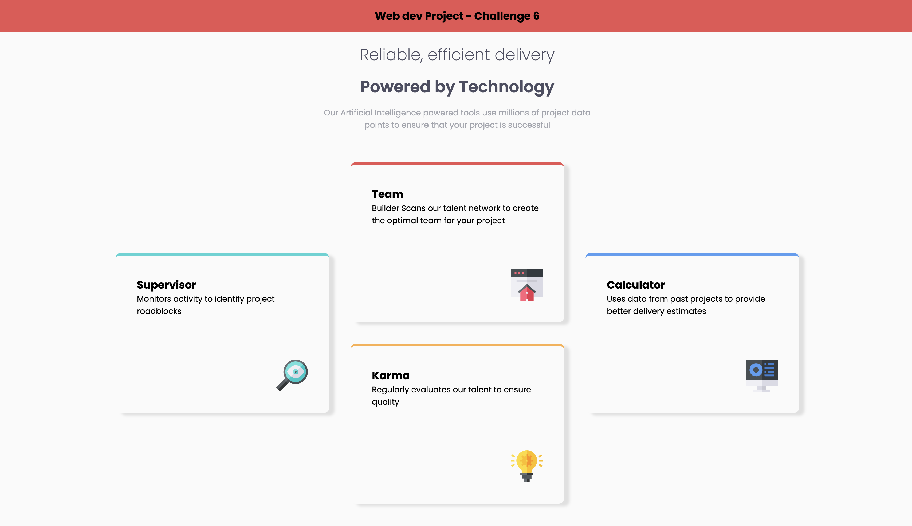

# Four Card Feature Section

This is a solution to the **Four Card Feature Section** challenge from [Frontend Mentor](https://www.frontendmentor.io).

## 🚀 Technologies Used

- **HTML5**: For semantic and accessible structure
- **CSS3**: Styling using CSS Grid, and media queries for responsiveness
- **Google Fonts**: Poppins for typography

## 📖 Lessons Learned

During this project, I learned and practiced:

- **CSS Grid Layout**: Understanding how to span and place grid items
- **Semantic HTML**: Using meaningful elements for better readability
- **Media Queries**: Making the design responsive for different screen sizes

---

🚀 **Thank you for checking out this project!** If you liked it, feel free to give it a ⭐ and connect with me for more awesome projects. Happy coding! 😊
